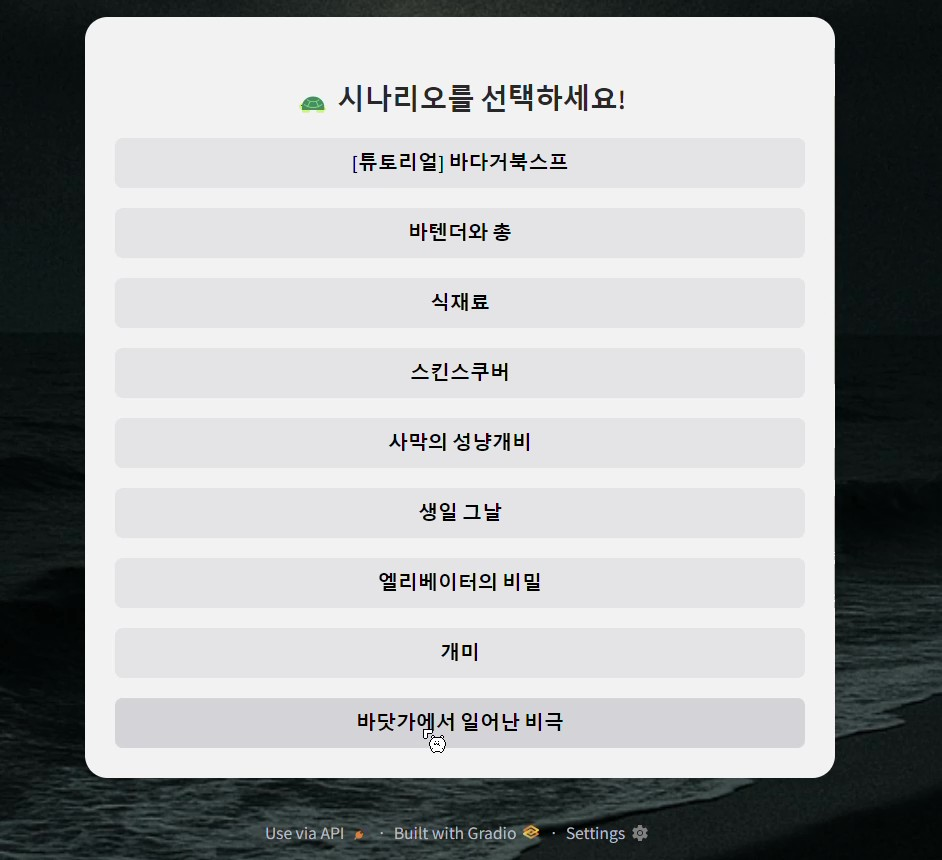
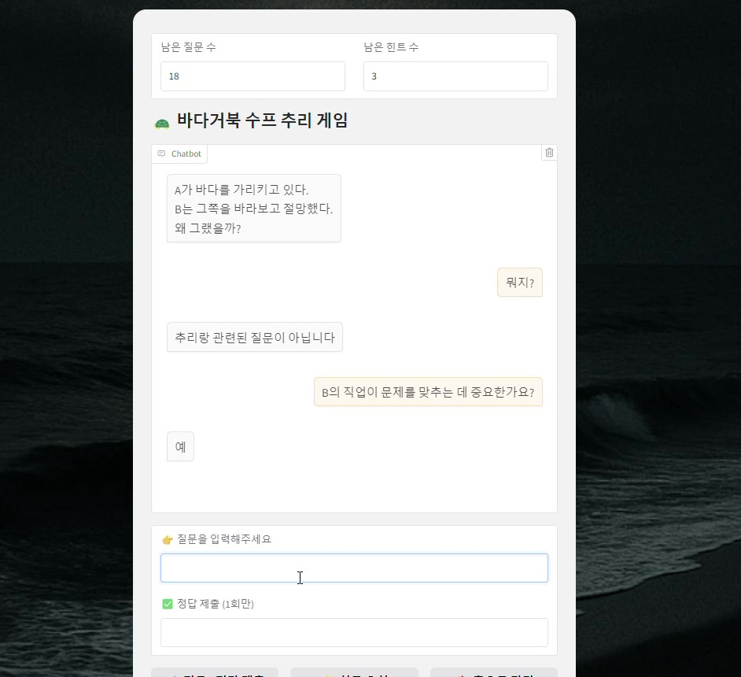
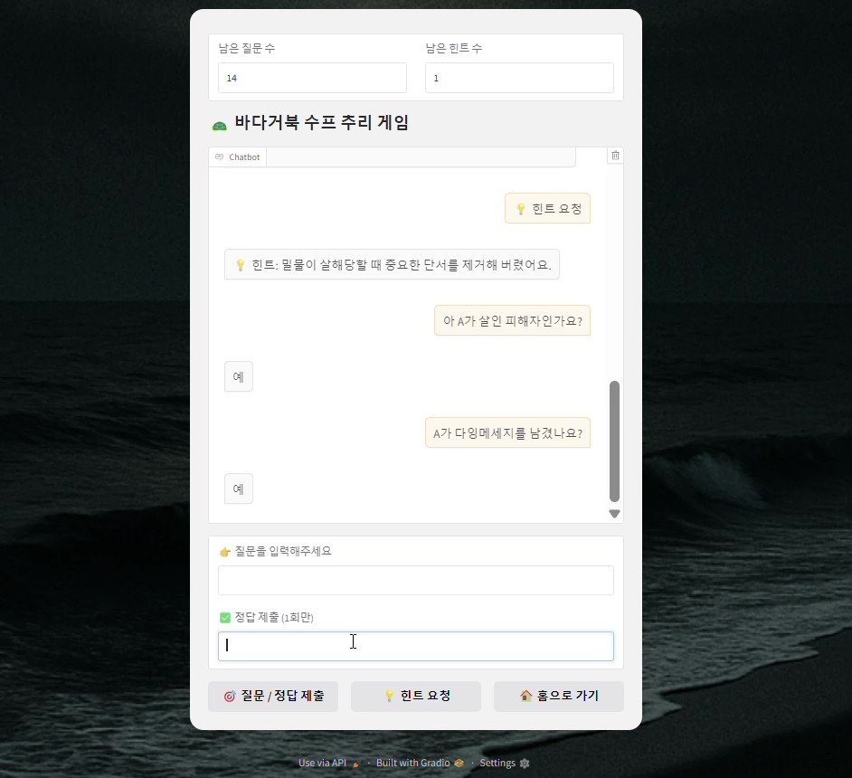
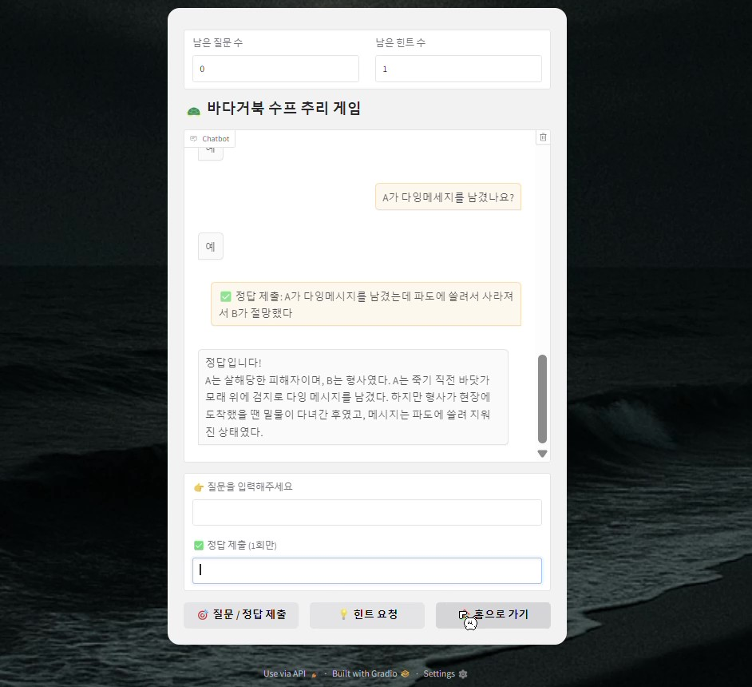

# 🐢 바다거북 수프 추리 게임
## ✨ 개요

**바다거북 수프**는 제한된 정보 속에서 **예/아니오로 답할 수 있는 질문**을 통해 사건의 진실을 추리하는 게임입니다.    
이 프로젝트는 **Gradio**, **Ollama**, **EEVE-korean-10.8B LLM**을 기반으로, 웹 환경에서 쉽게 즐길 수 있도록 제작되었습니다.   

---

### 🙌 예시
> 한 남자가 바닷가 레스토랑에서 바다거북 수프를 주문해 먹고, 집에 돌아가 목숨을 끊습니다. 
이유는 무엇일까요?

  
참가자들은 다음과 같이 **예/아니오 질문**을 통해 사건의 진실에 접근합니다.

- 그 이유가 수프를 먹은 것과 관련이 있습니까? → 예  
- 수프에는 진짜 바다거북이 들어 있었나요? → 예  
- 바다거북 수프가 맛이 없었나요? → 아니오  
- 남자는 빚을 지고 있었나요? → 상관없음

이런 방식으로 참가자들은 질문을 던지고, 출제자는 **예/아니오/상관없음**으로 대답합니다.   
  
⚫ **해답 요약**  
> 남자는 과거 조난 사고로 무인도에 표류했고, 자신도 모르게 **인육이 들어간 수프**를 먹은 경험이 있었습니다.  
레스토랑에서 **진짜 바다거북 수프**의 맛을 경험한 후, 과거의 진실을 깨닫고 목숨을 끊었습니다.

⚫ **핵심 요소**  
> 정답을 맞히는 것뿐만 아니라 **예리한 질문을 통해 진실에 다가가는 과정**이 핵심인 게임입니다.

---

## 🔧 기술 스택

## 🔉 사용 LLM

---

## 🎮 게임 설명

### 1. 시나리오 기반 추리 게임

- 출제자는 **이야기 형식의 수수께끼(시나리오)** 를 출제합니다.
- 참가자는 이야기의 전말을 알아내기 위해 **예/아니오로 대답 가능한 질문**을 던집니다.
- 질문을 통해 정보를 얻어 사건의 진실을 추리하고 정답을 유추해야 합니다.

### 2. 진행 방식

- 질문은 **최대 20회**까지 가능합니다.
- 정답은 **단 1회만 제출**할 수 있습니다.
- 힌트는 **최대 3회** 요청할 수 있습니다.
---

## 🧩 프롬프트 구조

- **질문**
  - 사용자 질문 → LLM 응답 (다음 중 하나):
    - `예`
    - `아니오`
    - `예/아니오로 대답할 수 없음`
    - `추리와 관련 없는 질문입니다`

- **정답 제출**
  - 사용자가 추리한 답을 입력하면, 정답 여부를 판단:
    - `정답입니다!`
    - `오답입니다.`

- **힌트 요청**
  - 사용자가 힌트를 요청하면, LLM이 **직접적인 정답 노출 없이도 본질에 가까운 힌트**를 1문장으로 제공

---

## 📽️ 실제 화면
|  시나리오 선택 |  질문 |
|--------------------------------------------------------|------------------------------------------------|
|  힌트           |  정답 제출 |
